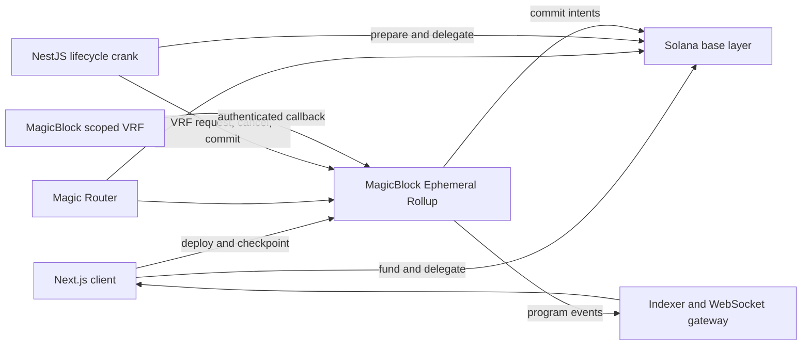

# BlitzMine

BlitzMine is a real-time, SOL-only competitive mining game on Solana. Players fund a reusable mining session, delegate its Miner account to a MagicBlock Ephemeral Rollup, and deploy SOL across a 5 by 5 grid during a 60-second round. MagicBlock VRF selects the winning square and the losing pool is shared among winners by contribution.

The project is being built for Solana Blitz v7, whose required integration is MagicBlock Ephemeral Rollups or Private Ephemeral Rollups. The collaboration theme is represented by simultaneous shared rounds, contribution-weighted rewards, and the live player chat.

## Product purpose

The demo should make one difference immediately visible: after a player starts a mining session, grid deployments execute on an Ephemeral Rollup instead of waiting on base-layer Solana. Every player sees the shared board change in real time while the economically important state remains program-controlled and can be committed back to Solana.

BlitzMine is not presented as “uncrackable.” The target is a small, auditable trust surface with explicit invariants, authenticated randomness, replay protection, deterministic fallback behavior, and no trusted game server deciding winners or balances.

## Hackathon requirements

- Build window: August 3 through August 9, 2026.
- Submission requires a public GitHub repository and a short demo video or live link.
- The project must integrate MagicBlock ER or PER.
- Judging emphasizes creativity, technical depth, build quality, and a compelling MagicBlock use case.
- The submission should clearly show the collaboration angle, not only mention it in copy.

Official entry points:

- [MagicBlock announcement](https://x.com/magicblock/status/2083553594889158857)
- [Hackathon site](https://hackathon.magicblock.app)
- [Submission site](https://build.magicblock.app)
- [MagicBlock documentation](https://docs.magicblock.gg)

## Game rules

1. The board contains 25 squares.
2. A deploy selects one or more previously unused squares for that miner and assigns the same SOL amount to each selected square.
3. The first accepted deploy starts the round’s 60-second clock.
4. Deployments stop exactly at the on-chain `end_ts`.
5. The lifecycle crank requests scoped MagicBlock VRF after the deadline.
6. The authenticated VRF callback selects a winning square using domain-separated, rejection-sampled randomness.
7. A 1% fee is separated from the round.
8. Ten percent of the post-fee losing pool is added to the motherlode.
9. Winners receive their fee-adjusted principal on the winning square plus their contribution-weighted share of winnings.
10. A round has a 1 in 625 chance of paying the accumulated motherlode to its winners.
11. If the winning square is empty, the post-fee pot is vaulted into the motherlode.
12. If VRF is not fulfilled within 30 seconds, the round is canceled and every miner can lazily recover the deployed principal through checkpointing. The system never rerolls the same round.
13. A 15-second intermission follows resolution or cancellation.

All monetary calculations use integer lamports, and SOL is the only game asset.

## Architecture



### Solana base layer

- Program deployment and upgrade authority.
- `Config`, initial `Board`, `Treasury`, and prepared `Round` accounts.
- Miner funding before delegation.
- Delegation records and committed checkpoints.
- SOL claims after Miner undelegation.

### Ephemeral Rollup

- Delegated `Board`, `Treasury`, `Round`, and `Miner` accounts.
- Timestamp-based round enforcement.
- Replay-protected deploys.
- VRF request, callback, cancellation, reward accounting, and checkpointing.
- Commit and commit-plus-undelegate intents.

### Backend

- Resolves the active ER through Magic Router.
- Automatically delegates the core game accounts on first lifecycle startup.
- Prepares and delegates the next Round account before it is needed.
- Requests randomness after the on-chain deadline.
- Cancels timed-out randomness requests.
- Commits completed game state to Solana.
- Indexes only authenticated program events and broadcasts live deploy and round-end messages.
- Never signs player deploys or chooses a winner.

### Frontend

- Presents a purpose-built shared grid, timer, live chat, and winner reveal.
- Funds a Miner PDA on base Solana.
- Delegates the Miner PDA through the canonical MagicBlock delegation accounts.
- Resolves the miner’s ER endpoint with Magic Router.
- Reads the Miner nonce from the ER and includes it in every deploy.
- Prompts the owner to checkpoint a previous round before entering a new one.
- Undelegates, refills, and re-delegates a settled Miner when its session balance is insufficient.
- Trusts the authenticated `FulfillRoundEvent` for winner display; it does not reconstruct ORAO results in the browser.

## Security and fairness invariants

- Only the configured admin can initialize and delegate shared game accounts.
- A miner can spend only the SOL represented by its program-owned Miner account.
- Miner authority is checked on funding, deployment, checkpointing, undelegation, and claims.
- Every deploy includes `expected_nonce`; stale or replayed transactions fail.
- Masks must be nonzero and limited to 25 bits.
- A miner pays for a square at most once per round.
- Board timestamps, not ER slot numbers or browser time, decide phases.
- Randomness is requested only after the deadline and delivered through `#[vrf_callback]` scoped identity authentication.
- The callback is bound to the current round and request nonce and is idempotent.
- Random draws use domain separation and rejection sampling instead of biased modulo-only sampling.
- Cancellation is allowed only after the fixed VRF timeout and produces refunds rather than a reroll.
- Reward settlement uses checked integer arithmetic.
- Owners may checkpoint immediately. A permissionless caller may checkpoint only during the final 12 hours of the 24-hour claim window and receives the reserved 10,000-lamport checkpoint fee.
- Admin fees are program-accounted and can be withdrawn only by the fixed fee collector.
- Client deployment reports are verified against on-chain transaction events before entering the database.

The program has not received an independent audit. Mainnet deployment is out of scope until a dedicated security review, adversarial economic tests, and live ER soak test are complete.

## Account lifecycle

### Bootstrap

1. Deploy the BlitzMine program to Solana.
2. Call `initialize` with the fixed admin authority.
3. Start the backend with its admin signer and MagicBlock endpoints.
4. The lifecycle manager checks and delegates Treasury, Round 0, and Board, then prepares and delegates Round 1.

### First player deploy

1. The wallet calls `fund_miner` on base Solana.
2. The wallet calls `delegate_miner` on base Solana.
3. The client waits for Magic Router to report the Miner as delegated.
4. The client reads the Miner state from its ER.
5. The wallet signs `deploy(amount, mask, expected_nonce)` for the ER.

### Later rounds

1. The owner checkpoints the previous resolved round on the ER.
2. If the session has enough SOL, the next deploy reuses the delegated Miner.
3. If it does not, the client commit-undelegates the settled Miner, funds the deficit on base, and delegates it again.

### Claim

1. Checkpoint the latest resolved round.
2. Commit-undelegate the Miner.
3. Wait until the updated Miner is visible on base Solana.
4. Call `claim_sol` on base Solana.

The current game UI wires funding, delegation, deployment, checkpoint, automatic refill, undelegation, and base-layer cash-out. The program lifecycle now passes locally against a real Ephemeral Rollup and VRF oracle; devnet validation remains required before release.

## Repository layout

```text
program/         Anchor program, IDL, tests, and generated SBF artifact
backend/         NestJS lifecycle manager, indexer, REST API, WebSocket gateway
frontend/        Next.js game client and Privy wallet integration
infrastructure/  Local Postgres and Redis configuration
```

Program ID: `CVud2PiM4hYk2YkDa2DZ2dnJwd9gVCXZFJP18DzE1r4F`

Admin and fee collector: `2W6NfyAnBghnUrksXxaQukyhVsH84YxmyTKxLXQiWM4M`

The keypair JSON files are local secrets and are ignored by Git. Never commit or paste them.

## Runtime configuration

Backend variables:

```dotenv
SOLANA_CLUSTER=devnet
SOLANA_RPC_URL=https://api.devnet.solana.com
SOLANA_WS_URL=wss://api.devnet.solana.com
PROGRAM_ID=CVud2PiM4hYk2YkDa2DZ2dnJwd9gVCXZFJP18DzE1r4F
MAGIC_ROUTER_URL=https://devnet-router.magicblock.app
EPHEMERAL_RPC_URL=https://devnet-as.magicblock.app
EPHEMERAL_WS_URL=wss://devnet-as.magicblock.app
EPHEMERAL_VALIDATOR=MAS1Dt9qreoRMQ14YQuhg8UTZMMzDdKhmkZMECCzk57
ADMIN_KEYPAIR=<base58 secret key or JSON byte array>
```

Frontend variables:

```dotenv
NEXT_PUBLIC_API_URL=http://localhost:3001
NEXT_PUBLIC_WS_URL=ws://localhost:3001
NEXT_PUBLIC_SOLANA_CLUSTER=devnet
NEXT_PUBLIC_SOLANA_RPC_URL=https://api.devnet.solana.com
NEXT_PUBLIC_PROGRAM_ID=CVud2PiM4hYk2YkDa2DZ2dnJwd9gVCXZFJP18DzE1r4F
NEXT_PUBLIC_PRIVY_APP_ID=<privy app id>
NEXT_PUBLIC_ALLOW_NON_MAINNET_IN_PRODUCTION=true
```

Copy [`backend/.env.example`](backend/.env.example) and [`frontend/.env.example`](frontend/.env.example) before starting services. Database and Redis variables are also required.

## Local commands

Program:

```bash
cd program
cargo test --package blitzmine --lib
anchor idl build --skip-lint
cargo build-sbf --tools-version v1.53 --sbf-out-dir target/deploy
anchor test --skip-build
```

Complete local protocol cycle:

```bash
cd program
bun install
bun run cycle:local
```

This one command builds the program, starts a clean Solana validator, MagicBlock Ephemeral Rollup, Magic Router, and local VRF oracle, then runs two independent miners through funding, delegation, competing deployment, replay rejection, authenticated VRF settlement, exact payout checks, checkpointing, base-layer commitment, undelegation, and cash-out. It uses a five-second local-only round while the normal program remains fixed at 60 seconds. No production keypair, database, backend, frontend, or Privy credential is required.

The command requires Bun, Rust, Anchor 0.32.1, Solana CLI with `cargo build-sbf`, and ports 6699, 6700, 7799, 7800, 8899, and 8900. It downloads the pinned MagicBlock local validator package on first use. A successful run ends with `Full cycle passed` and writes transaction evidence to `program/.local-e2e/result.json`. Service logs are written to `program/.local-e2e/logs`.

Complete local browser stack:

```bash
bun run dev:local
```

This starts a clean local Solana validator, Ephemeral Rollup, Magic Router, scoped VRF oracle, PostgreSQL, Redis, backend, and frontend. It initializes and delegates the shared game accounts automatically and keeps the stack running until `Ctrl+C`. The authenticated local faucet funds connected test wallets only when the backend uses a loopback RPC and `NODE_ENV` is not production.

Before running it, set matching Privy credentials in the ignored `backend/.env` and `frontend/.env.local` files and allow `http://localhost:3000` and `http://127.0.0.1:3000` in the Privy dashboard. Use two browser profiles with separate Solana wallets for the multiplayer cycle. Browser rounds last 60 seconds; the automated protocol runner keeps its separate five-second build.

Backend:

```bash
cd backend
bun install
bun run build
bun run test -- --runInBand
```

Frontend:

```bash
cd frontend
bun install
bunx tsc --noEmit
bun run test
bun run build
```

## Verified state on August 7, 2026

- Rust unit tests: 5 passed, including randomness bounds and lamport-conservation properties.
- Anchor base-layer integration tests: initialize, prepare next round, and fund Miner passed on a fresh local validator.
- Anchor IDL generation passed.
- SBF compilation passed with Solana platform tools v1.53.
- Backend build passed.
- Backend tests: 55 tests across 13 suites passed.
- Frontend type-check passed.
- Frontend tests: 31 passed, including exact instruction encoding, session account flow, resolution, settlement state, and reveal scheduling.
- Frontend production build passed without requiring a Privy credential at prerender time.
- Full local MagicBlock cycle passed with two fresh miners, a real local ER, Magic Router, scoped VRF callback, state commitment, undelegation, and base-layer claim.
- The local test proved the stale-nonce replay guard and exact 50,000,000-lamport deployment and payout accounting.
- Prisma validation and client generation passed against the SOL-only schema and clean initial migration.
- The repository source, migrations, manifests, infrastructure, filenames, and public assets contain no legacy product modules or branding.

Devnet deployment, cancellation-path integration, and multi-round soak validation remain release blockers.

## Remaining implementation plan

### Release blocker 1: devnet deployment and soak test

- Fund the program authority with devnet SOL.
- Deploy the exact tested SBF artifact.
- Initialize once and verify all PDA addresses.
- Run the backend against Magic Router and one fixed devnet ER validator.
- Run at least 20 consecutive rounds with two wallets and forced reconnects.
- Verify Router recovery, backend restart reconciliation, duplicate crank safety, WebSocket replay behavior, and committed base state.

### Release blocker 2: finish product surface

- Validate the cash-out action across checkpoint, undelegation, Router synchronization, and `claim_sol`.
- Add an in-product rules and fairness panel.
- Show transaction links for base funding, delegation, deploy, resolution, and claims.
- Add clear states for Router unavailable, ER synchronization, insufficient wallet balance, user rejection, and timed-out delegation.
- Run responsive and wallet testing in Chromium, Safari, and a mobile viewport.

### Release blocker 3: security and submission

- Add property tests for conservation of lamports across winning, empty-square, jackpot, cancellation, expiry, and rounding cases.
- Add adversarial tests for replay, wrong authority, early reset, duplicate callback, wrong nonce, invalid masks, pre-created rounds, double checkpoint, and premature bot checkpoint.
- Add a full ER cancellation test that withholds VRF fulfillment, crosses the timeout, commits the canceled round, and proves both miners recover principal.
- Add an idempotent expired-round sweep that moves rounding dust and unclaimed payouts into the motherlode before committed Round accounts are closed.
- Pin deployment artifact hashes and record deployed program data.
- Remove local secrets and generated ledgers from Git status.
- Produce a 60 to 90 second demo showing concurrent players, ER latency, authenticated VRF, live chat, payout, and base-layer commitment.
- Prepare the public repository, live link, architecture image, and submission copy.

## Definition of done

The project is submission-ready only when a fresh wallet can fund, delegate, deploy, see a shared round resolve, checkpoint, and cash out without manual account repair; a second wallet can compete in the same round; the backend can restart without corrupting lifecycle state; a full local ER test and a multi-round devnet soak test pass; and the public repository contains no secret key material.

## Primary technical references

- [Ephemeral Rollup architecture](https://docs.magicblock.gg/pages/ephemeral-rollups-ers/introduction/ephemeral-rollup)
- [Local MagicBlock development](https://docs.magicblock.gg/pages/ephemeral-rollups-ers/how-to-guide/local-development)
- [VRF security](https://docs.magicblock.gg/pages/verifiable-randomness-functions-vrfs/introduction/security)
- [VRF best practices](https://docs.magicblock.gg/pages/verifiable-randomness-functions-vrfs/how-to-guide/best-practices)
- [Magic Actions atomicity and troubleshooting](https://docs.magicblock.gg/pages/ephemeral-rollups-ers/magic-actions/troubleshooting)
- [MagicBlock security and audits](https://docs.magicblock.gg/pages/overview/additional-information/security-and-audits)
- [MagicBlock engine examples](https://github.com/magicblock-labs/magicblock-engine-examples)
- [Ephemeral Rollups SDK](https://github.com/magicblock-labs/ephemeral-rollups-sdk)
- [MagicBlock VRF program](https://github.com/magicblock-labs/solana-vrf)
