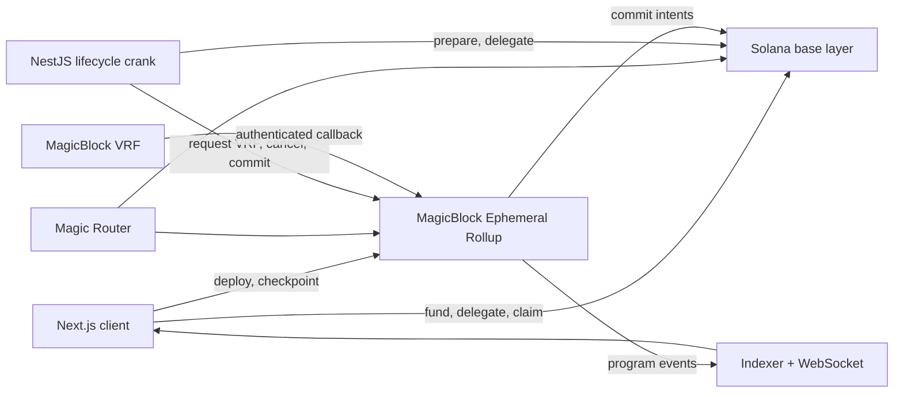

# BlitzMine

A real time mining game on Solana. Everyone plays the same board at the same time, and a round lasts 60 seconds.

If you have used ore.supply the mining idea will feel familiar, except here you are not mining alone. There is a 5x5 grid, you put SOL on whichever tiles you want, and when the timer hits zero one tile wins. Everyone who backed that tile splits the pot based on how much they put in.

Built for Solana Blitz V7, which is themed around collaboration and requires a MagicBlock Ephemeral Rollup integration.

**Live on devnet:** https://blitzmine.up.railway.app

| | |
|---|---|
| Program ID | `CVud2PiM4hYk2YkDa2DZ2dnJwd9gVCXZFJP18DzE1r4F` |
| Board account | [`HP84j7GA...cWrxe`](https://explorer.solana.com/address/HP84j7GAHrpxRfdYj8M4pEURggy4v3HbSBvp5t9cWrxe?cluster=devnet) (owned by the MagicBlock delegation program) |
| API | https://blitz-mine.up.railway.app |
| Network | devnet |

## How the game works

1. The board has 25 tiles.
2. You pick one or more tiles you have not used this round and put the same amount of SOL on each.
3. The first deploy of a round starts the 60 second clock. Before that the board just sits and waits.
4. Deploys stop exactly at the on chain deadline.
5. After the deadline the backend asks MagicBlock VRF for randomness.
6. The VRF callback picks the winning tile on chain.
7. A 1 percent fee comes off the round.
8. 10 percent of what is left of the losing pool goes into the motherlode.
9. Winners get their own SOL back (minus fee) plus a share of the losing pool, weighted by how much they put on the winning tile.
10. Every round has a 1 in 625 chance of paying out the whole motherlode.
11. If nobody was on the winning tile, the entire pot goes into the motherlode instead.
12. If VRF does not come back within 30 seconds the round is cancelled and everyone can recover their principal. It never rerolls the same round.
13. There is a 15 second break, then the next round.

Everything is in integer lamports and SOL is the only asset in the game.

## Why MagicBlock

A shared 60 second round does not really work on base layer Solana. Every move would sit there waiting to confirm and the round would be over before it landed.

So the whole game gets delegated to a MagicBlock Ephemeral Rollup. The board, the treasury, the round account and each player's mining session all live on the rollup while a round is running. Deploys land there, which is why players see each other's moves instantly, and the state gets committed back down to Solana afterwards.

The winning tile comes from MagicBlock VRF. The backend can only ask for randomness once the deadline has passed. It has no way to pick a tile, and the callback runs on chain, so there is no server sitting in the middle deciding who won.

## Architecture



**Solana base layer** holds the program, the config, and the accounts before they are delegated. Players fund their miner and claim their SOL here.

**Ephemeral Rollup** holds the delegated board, treasury, round and miner accounts while a round is live. Deploys, VRF settlement and checkpoints all happen here.

**Backend** is a NestJS service. It resolves the active rollup through Magic Router, prepares and delegates the next round before it is needed, asks for randomness once the deadline passes, cancels timed out rounds, commits finished rounds back to Solana, and indexes program events out to the frontend over WebSocket. It never signs a player's deploy and it cannot pick a winner.

**Frontend** is a Next.js client using Privy for wallets. It funds and delegates the miner, reads the miner nonce off the rollup, and sends deploys straight to the rollup.

### What runs where

| Instruction | Runs on |
|---|---|
| `initialize`, `prepare_round`, `fund_miner`, `claim_sol` | base layer |
| `delegate_board`, `delegate_treasury`, `delegate_round`, `delegate_miner` | base layer |
| `deploy`, `checkpoint` | rollup |
| `request_randomness`, `callback_resolve_round`, `cancel_round` | rollup |
| `commit_game`, `commit_checkpoint`, `undelegate_miner` | rollup, commits to base |

## What keeps it fair

- Only the fixed admin key can initialize and delegate the shared game accounts.
- A miner can only ever spend the SOL sitting in its own program owned account.
- Every deploy carries an `expected_nonce`. A stale or replayed transaction fails.
- Masks have to be non zero and inside 25 bits, and you pay for a tile at most once per round.
- Phases are decided by on chain timestamps, not by browser time or slot numbers.
- Randomness is only requested after the deadline, and the callback is authenticated, bound to the round and request nonce, and idempotent.
- Draws use domain separation and rejection sampling instead of plain modulo, so there is no bias.
- Cancellation is only allowed after the fixed VRF timeout, and it refunds rather than rerolling.
- Payout maths is checked integer arithmetic. There is a unit test asserting no lamport is created or lost.
- Deploy reports coming from the client are re-derived from the on chain transaction before anything is written to the database.

The program has not been audited. It is devnet only and mainnet is out of scope until that changes.

## Repo layout

```
program/         Anchor program, tests, and the local MagicBlock runner
backend/         NestJS crank, indexer, REST API, WebSocket gateway
frontend/        Next.js client and Privy wallet integration
infrastructure/  Docker and k8s config
```

## Running it

You need Bun, Rust, Anchor 0.32.1, and the Solana CLI with `cargo build-sbf`.

### Program tests

```bash
cd program
cargo test --lib
```

### Full protocol cycle against a real rollup

```bash
cd program
bun install
bun run cycle:local
```

This is the interesting one. It builds the program, starts a clean validator, an Ephemeral Rollup, Magic Router and a local VRF oracle, then runs two miners through funding, delegation, competing deploys, replay rejection, VRF settlement, exact payout checks, checkpointing, commit back to base, undelegation and cash out.

It needs ports 6699, 6700, 7799, 7800, 8899 and 8900. A successful run prints `Full cycle passed` and writes the transaction evidence to `program/.local-e2e/result.json`.

Rounds are 5 seconds in this mode so the test does not take forever. The real program stays at 60.

### Whole stack in a browser

```bash
bun run dev:local
```

Starts a local validator, rollup, router, VRF oracle, Postgres, Redis, backend and frontend, and delegates the shared accounts for you. You need Privy credentials in `backend/.env` and `frontend/.env.local` first, and `http://localhost:3000` allowed in the Privy dashboard.

### Backend and frontend on their own

```bash
cd backend && bun install && bun run build && bun run test
cd frontend && bun install && bunx tsc --noEmit && bun run test && bun run build
```

## Config

Backend:

```dotenv
SOLANA_CLUSTER=devnet
SOLANA_RPC_URL=https://api.devnet.solana.com
PROGRAM_ID=CVud2PiM4hYk2YkDa2DZ2dnJwd9gVCXZFJP18DzE1r4F
MAGIC_ROUTER_URL=https://devnet-router.magicblock.app
EPHEMERAL_RPC_URL=https://devnet-as.magicblock.app
EPHEMERAL_VALIDATOR=MAS1Dt9qreoRMQ14YQuhg8UTZMMzDdKhmkZMECCzk57
ADMIN_KEYPAIR=<base58 secret key or JSON byte array>
DATABASE_URL=...
REDIS_URL=...
```

Frontend:

```dotenv
NEXT_PUBLIC_API_URL=https://blitz-mine.up.railway.app
NEXT_PUBLIC_WS_URL=wss://blitz-mine.up.railway.app
NEXT_PUBLIC_SOLANA_CLUSTER=devnet
NEXT_PUBLIC_SOLANA_RPC_URL=https://api.devnet.solana.com
NEXT_PUBLIC_PROGRAM_ID=CVud2PiM4hYk2YkDa2DZ2dnJwd9gVCXZFJP18DzE1r4F
NEXT_PUBLIC_PRIVY_APP_ID=<privy app id>
```

Running in production against anything other than mainnet needs `ALLOW_NON_MAINNET_IN_PRODUCTION=true` on the backend and `NEXT_PUBLIC_ALLOW_NON_MAINNET_IN_PRODUCTION=true` on the frontend. Both services refuse to boot otherwise, on purpose.

Keypair files are local secrets and are gitignored. Do not commit them.

## Tests

| | |
|---|---|
| Rust unit tests | 5 |
| Backend | 55 across 13 suites |
| Frontend | 31 |

The Rust ones cover account sizes, randomness bounds, and a property test that settlement conserves every lamport for every total from 0 to 10,000.

## Known gaps

Being straight about what is not finished:

- The indexer never writes `Reward` rows, so profile and leaderboard stats show 0 wins even after you win. The game itself settles correctly, it is only that stats surface that is wrong.
- Chat reactions are broadcast by the server but the client has no handler for the event, so they do not show up live.
- The backend issues a refresh token but there is no route to redeem it, so the session just expires after 15 minutes and you sign in again.
- `program/programs/blitzmine/src/instructions/close.rs` is dead code. It is not in the module tree and does not compile. Closing expired rounds and sweeping dust into the motherlode is still to do.
- `infrastructure/docker/Dockerfile.program` pins Anchor 0.30.1 and cannot build this program. Use the local runner instead.

## Links

- [Ephemeral Rollups](https://docs.magicblock.gg/pages/ephemeral-rollups-ers/introduction/ephemeral-rollup)
- [VRF security](https://docs.magicblock.gg/pages/verifiable-randomness-functions-vrfs/introduction/security)
- [Ephemeral Rollups SDK](https://github.com/magicblock-labs/ephemeral-rollups-sdk)
- [MagicBlock VRF program](https://github.com/magicblock-labs/solana-vrf)
